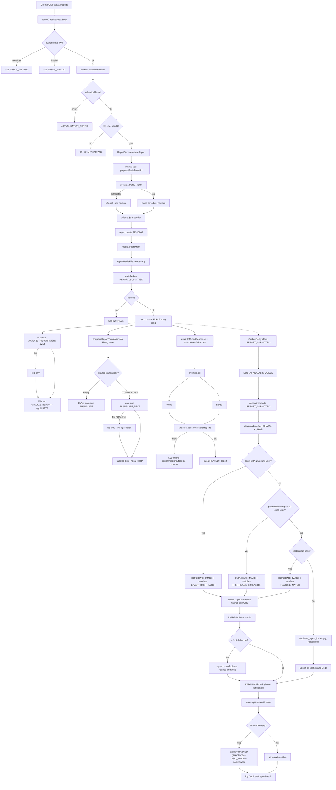

# 8. Flow Diagram

`POST /api/v1/reports` — Client → Controller → Validation → Service → Database / External → Response.

**Tuần tự (HTTP):** auth → validate → download + EXIF (`prepareMediaFromUrl`, ngoài transaction) → transaction (`report` → `media` → `report_media_files` → `emitOutbox REPORT_SUBMITTED` → commit).

**Song song sau commit (không `await` queue):** kick-off `ANALYZE_REPORT` và `TRANSLATE_TEXT` rồi chạy `attachVotesToReports`. HTTP **không** đợi SQS / worker / duplicate. Trong `attachVotesToReports`, votes và saved chạy `Promise.all`; profile identity chạy sau khi hai query đó xong.

**Ngoài HTTP (sau commit):** `OutboxRelay` đẩy `REPORT_SUBMITTED` sang SQS AI. `ai-service` cascade SHA-256 → pHash → ORB (cùng `userId`, exclude report hiện tại). Nếu có ảnh trùng lặp, xóa hash và ORB của các ảnh duplicate, chỉ upsert các ảnh không trùng lặp còn lại (nếu có), rồi `PATCH /internal/v1/reports/:id/duplicate-verification` với body là mảng `{ duplicate_report_id, matches }[]`. Không chạy authenticity / risk. Duplicate **không** rollback report đã tạo. Nếu phát hiện trùng lặp (mảng không rỗng), `incident-service` tự động đặt `status = BANNED` (`_STATUS_INACTIVE`), lưu `rejectReason = DUPLICATE_IMAGE` và gửi thông báo cho chủ sở hữu báo cáo. GET report trả `duplicate_verification` (null trước khi worker ghi, `[]` nếu đã check và không trùng).

